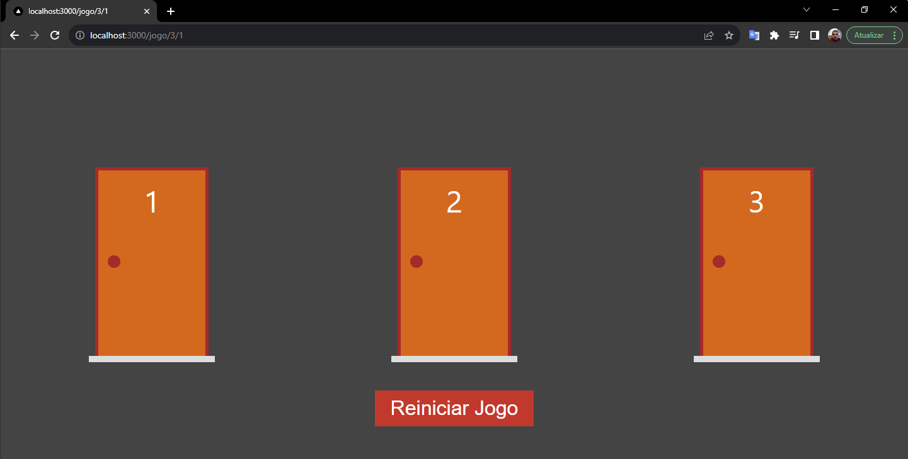
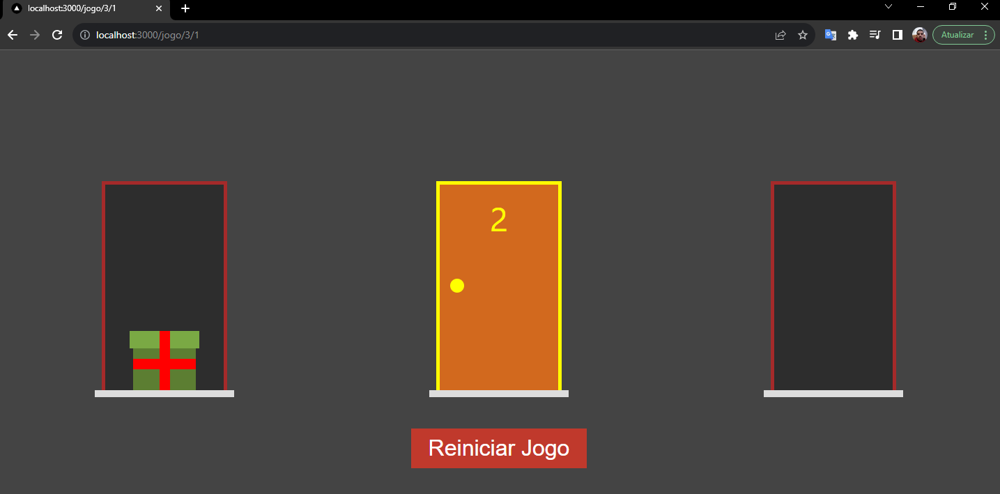
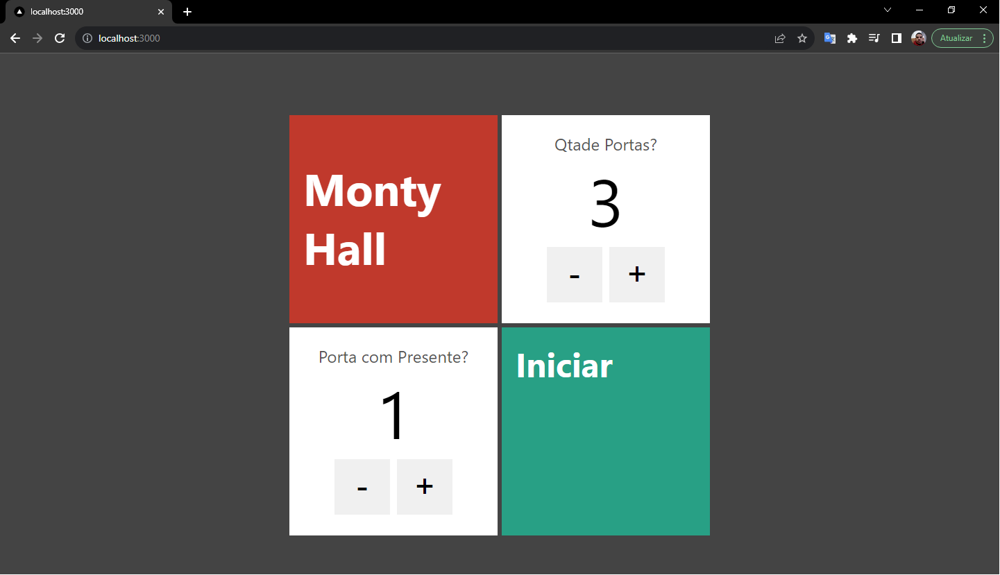

<h1 align="center">Porta Premiada com React + Next.JS</h1>

Next.js é uma estrutura da web de desenvolvimento front-end React de código aberto criada por Vercel que permite funcionalidades como renderização do lado do servidor e geração de sites estáticos para aplicativos da web baseados em React.

## Início

Consiste em você mostrar para um participante três portas e uma delas será a premiada, o usuário terá a possibilidade de escolher uma porta tentando adivinha se o presente está na qual escolheu.

  

Será aberto as demais e uma por vez, mantendo o suspense, podendo trocar de porta durante o jogo, a porta fica em amarelo nas bordas a qual o participante escolheu.

  

No Inicio do Jogo pode escolher entre 3 a 20 portas, escolhendo qual será a porta premiada.

  

## Construído com:

* [Next.js](https://nextjs.org/)
* [React](https://react.dev/)

